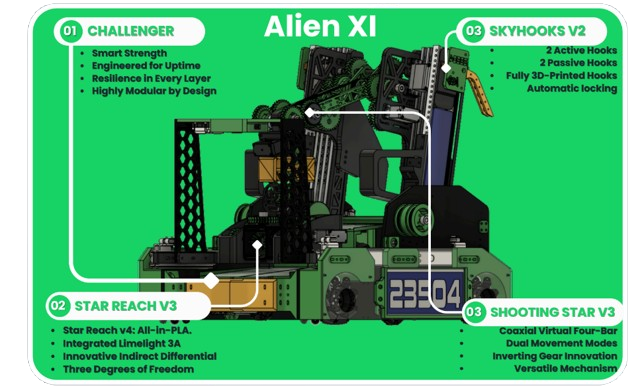
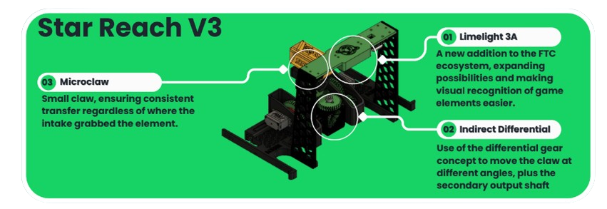
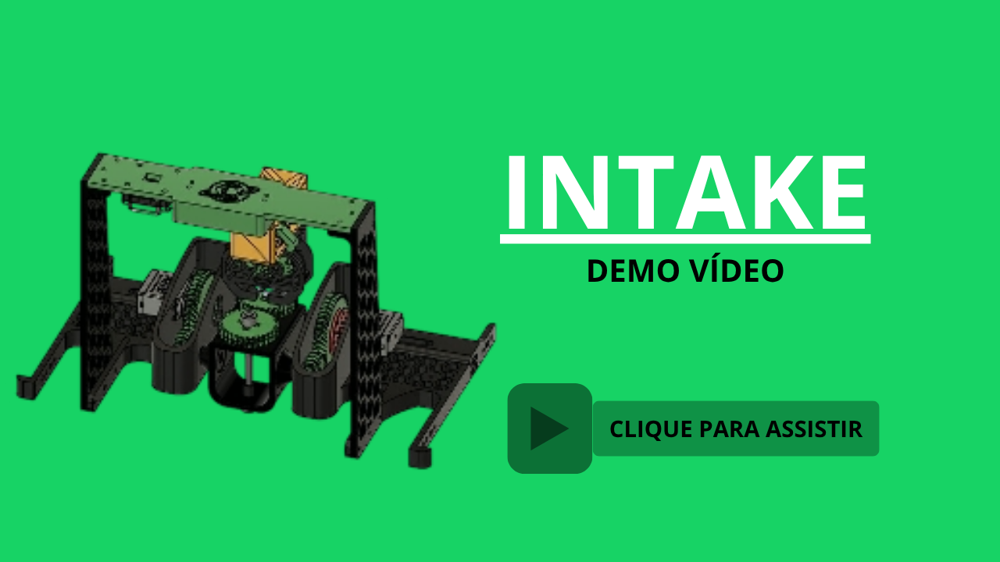
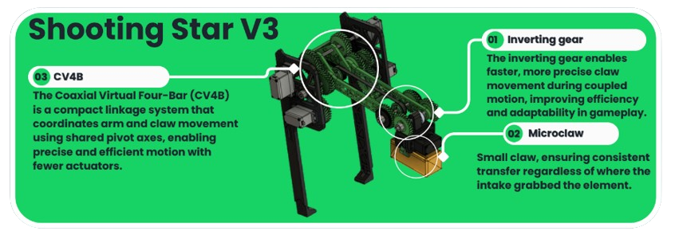
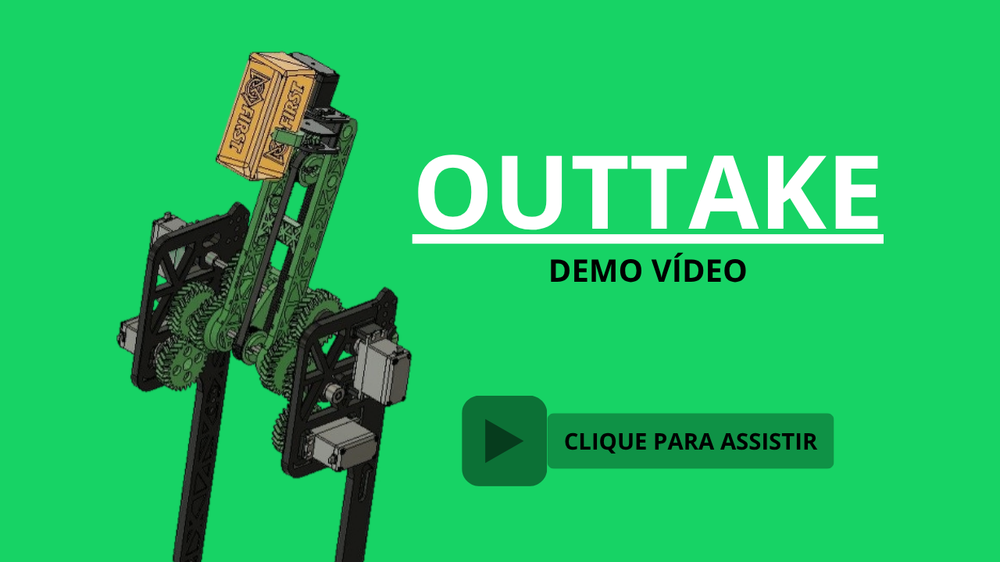
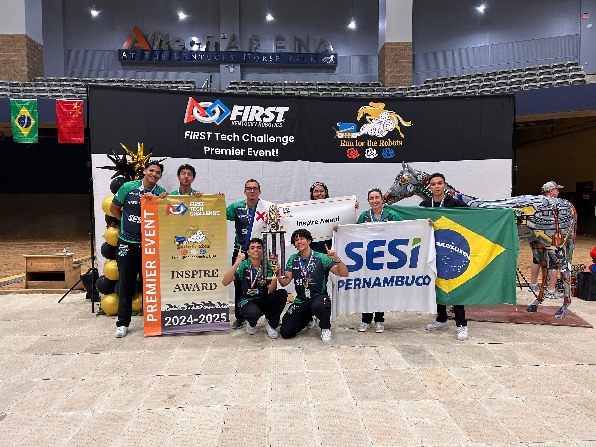

<div align="center">

# SpaceTech-IntoTheDeep

Documentação pública do processo de engenharia, projetos e impacto da equipe **SpaceTech 23504** durante a temporada **Into The Deep** do **First Tech Challenge (FTC)**.

[](https://www.firstinspires.org/robotics/ftc)
[]()
[]()

</div>

Durante a temporada **Into The Deep**, a equipe desenvolveu soluções integradas de mecânica, software, odometria e visão computacional para elevar o desempenho do robô em partidas autônomas e teleoperadas. Esta documentação apresenta os principais subsistemas, as tecnologias utilizadas e os resultados alcançados.


---

## Sumário
- [O que é o FIRST Tech Challenge?](#o-que-é-o-first-tech-challenge)
- [O Desafio: Into The Deep](#o-desafio-into-the-deep)
- [Prêmios e Conquistas](#prêmios-e-conquistas)
- [Engenharia Mecânica](#engenharia-mecânica)
  - [DriveTrain](#drivetrain)
  - [Intake (Coleta)](#intake-coleta)
  - [Outtake (Pontuação)](#outtake-pontuação)
- [Software e Inteligência](#software-e-inteligência)
  - [Sensores utilizados](#sensores-utilizados)
  - [Odometria](#odometria)
  - [Controle PID + FeedForward](#controle-pid--feedforward)
  - [Computação visual](#computação-visual)
- [Créditos](#créditos)

---

## O que é o FIRST Tech Challenge?

O FIRST Tech Challenge (FTC) é uma competição internacional de robótica para estudantes do ensino médio. O desafio não é apenas construir um robô, mas gerir uma equipe como uma empresa de engenharia, documentando processos, desenvolvendo tecnologia de ponta e gerando impacto social através do "Gracious Professionalism" (Profissionalismo Ético).

## O Desafio: Into The Deep

A temporada 2024-2025, Into The Deep, transporta as equipes para uma exploração subaquática fictícia. O objetivo central é coletar e processar "recursos" marinhos:

- Samples (Amostras): Peças plásticas coloridas que devem ser depositadas em cestas (Baskets) em diferentes alturas.

- Specimens (Espécimes): Peças que devem ser "presas" em barras horizontais (Submersible) através de ganchos.

- Final: No fim da partida, os robôs devem escalar as barras da estrutura central para ganhar pontos extras, simulando a subida das profundezas.


### Assista o vído do desafio da temporada:
[](https://www.youtube.com/watch?v=ewlDPvRK4U4)


---

## Prêmios e Conquistas

### Run For The Robots Premier Event - Kentucky, EUA
- **Inspire Award**

### Brazil Championship - Brasília
- **Innovate Award sponsored by RTX** — 2º lugar

### Torneio Regional SESI de Robótica - Pernambuco
- **Winning Alliance - Captain**
- **Design Award**
<br>

---

## Engenharia Mecânica

<p align="center">
  
</p>

Para enfrentar a versatilidade necessária no Into The Deep, projetamos um robô de baixo centro de massa e alta extensão vertical.

### Subsistemas Principais

- Intake (Coleta): Utilizamos um sistema de slides lineares que estende o alcance em 0,7 metros. A garra possui um sistema diferencial que permite rotação em 3 eixos, essencial para capturar objetos em qualquer ângulo no chão sem a necessidade de reposicionar o robô inteiro.

- Outtake (Pontuação): O sistema de elevação atinge até 1,5 metros de altura. Implementamos um braço de 4 barras virtuais autoalinhante, garantindo que a garra mantenha o ângulo correto de depósito independentemente da altura do elevador.

- DriveTrain: Base de tração holonômica para movimentação ágil e precisa em qualquer direção.

### DriveTrain
### Intake (Coleta): Star Reach V3

<p align="center">
  
</p>

Inspirada no sistema diferencial dos automóveis, a nossa garra foi desenvolvida para capturar elementos em qualquer ângulo, reduzindo o tempo de coleta. Utilizando o Limelight 3A para visão computacional e um diferencial indireto no mecanismo, o Star Reach V3 oferece 3 graus de liberdade, permitindo um alinhamento automático preciso.

### Demonstração Intake: 

<p align="center">
  <a href="https://github.com/user-attachments/assets/b7defe61-2e17-4f4e-9bdc-3461cfbcb212">
    
  </a>
</p>

### Outtake (Pontuação): Shooting Star V3

<p align="center">
  
</p>

O Shooting Star V3 incorpora o mecanismo CV4B (Coaxial Virtual Four-Bar), que permite um movimento compacto e coordenado entre o braço e a garra. Com o uso de engrenagem inversora, a nossa equipe alcançou uma maior precisão e velocidade no disparo dos elementos. Cada etapa do design foi validada: do esboço ao protótipo, até a iteração final, garantindo eficiência no desempenho.


### Demonstração Outtake: 

<p align="center">
  <a href="https://github.com/user-attachments/assets/68815073-1c05-46ef-be1b-91d6254df0e5">
    
  </a>
</p>

<br>
---

## Software e Inteligência

### Sensores utilizados

- 2x [Swingarm Odometry Pod](https://www.gobilda.com/swingarm-odometry-pod-48mm-wheel/).
- 1x [Pinpoint V2 Odometry Computer](https://www.gobilda.com/pinpoint-v2-odometry-computer-imu-sensor-fusion-for-2-wheel-odometry/).
- 2x [Touch Sensor](https://www.revrobotics.com/rev-31-1425/).
- 1x [LimeLight 3A CameraVision](https://stemos.com.br/produto/22036390/).

---

## Odometria

Utilizamos dois pods de odometria para estimar a posição do robô em tempo real em relação à arena, em conjunto com o Pinpoint Odometry Computer, que possui IMU integrada. Dessa forma, foi possível gerar a posição cartesiana do robô com coordenadas X e Y, além da sua orientação em graus.

<p align="center">
  
</p>

Com isso, foi possível criar trajetórias e aplicar algoritmos de controle durante o período autônomo, garantindo que o percurso realizado fosse sempre o mesmo, independentemente de variações do ambiente externo ou interno.

Com a biblioteca [Pedro Pathing](https://pedropathing.com/), os caminhos são gerados a partir de curvas de Bézier e recebem três controladores PID: lateral, frontal e de posição, além de uma correção de força centrípeta. Os caminhos também podem ser criados no [Pedro Pathing Visualizer](https://visualizer.pedropathing.com/).

[Assista ao teste da correção de caminhos](https://github.com/user-attachments/assets/5989fa0b-0b74-4dd0-9eb7-b81cfcb7481f)

Observe os primeiros testes da correção de caminhos em um primeiro protótipo:

[Assista ao protótipo](https://github.com/user-attachments/assets/792c633d-ddad-4b84-b477-c624ee670848)

<p align="center">
  
</p>

---

## Controle PID + FeedForward

Para o controle de posição dos mecanismos, como elevadores e extensores, utilizamos o controle Proporcional, Integral e Derivativo. Esse tipo de controle corrige o erro atual, considera o acúmulo de erro ao longo do tempo e reage à taxa de variação, reduzindo o tempo de resposta e melhorando a estabilidade do sistema.

$$u(t) = K_p e(t) + K_i \\int_{0}^{t} e(\\tau) d\\tau + K_d \\frac{de(t)}{dt}$$

Onde:
- \(e(t)\) é o erro, calculado como SP - PV, isto é, ponto de referência menos a entrada do sensor.
- \(K_p\) é o ganho proporcional, responsável por corrigir o erro atual.
- \(K_i\) é o ganho integral, responsável por corrigir o erro acumulado.
- \(K_d\) é o ganho derivativo, responsável por prever a tendência do erro com base em sua variação.

Os motores utilizados possuem encoders embutidos, que retornam a posição em ticks por revolução. Com um cálculo que leva em consideração a relação de redução utilizada, é possível converter esse valor em uma posição relativa da rotação do motor em ângulos.

```java
double CPR = [Ticks por revolução aqui];

// Pega a posição atual do motor
int position = motor.getCurrentPosition();
double revolutions = position / CPR;

double angle = revolutions * 360;
```

Entretanto, isso sozinho não foi suficiente, porque a temporada exigia um elevador vertical constantemente influenciado pela gravidade. Nesse cenário, o PID isolado se tornava difícil de ajustar. Por isso, foi implementado também o controle FeedForward, que funciona em malha aberta e fornece parte da energia necessária para o movimento antes mesmo que o erro apareça.

Ambos foram implementados utilizando a biblioteca [NextFTC-0.6](https://v0.nextftc.dev/user-guide/subsystems/lift).

### Resultado

[Assista ao resultado](https://github.com/user-attachments/assets/329a2a23-8ccb-4523-9826-523bd5d730a8)

---

## Computação visual

Utilizamos a Limelight 3A, uma câmera com integração de IA, para automatizar alguns processos durante o jogo. O objetivo era identificar as amostras de jogo e sua orientação para definir a posição correta da garra e, assim, economizar tempo e aumentar a confiabilidade.

Utilizamos a biblioteca OpenCV e, com o ColorBlob Detector, identificamos regiões com grande quantidade de pixels de uma cor específica, como vermelho, azul ou amarelo, e criamos um contorno retangular nessa área. Se a largura do retângulo for maior que a altura, a amostra está na horizontal; caso contrário, está na vertical. A partir disso, criamos um gatilho para que a garra descesse na posição predefinida de coleta.

<p align="center">
  
</p>

[Assista à detecção visual](https://github.com/user-attachments/assets/267b23d4-f4fb-4d22-b8fd-2ddf04a26233)


## Demonstração Autonomo:
<br>

https://github.com/user-attachments/assets/6ec970c4-e6fa-420e-a925-03d73556fa0b


---

## Créditos

Projeto desenvolvido pela equipe .

Esse projeto foi desenvolvido colaborativamente pelos membros da equipe **SpaceTech 23504** durante a  temporada INTO THE DEEP.

| Name | Role | Contributions | Contato 
|---|---|---|---|
| Marcos Trajano | Progamador | Sistemas autonomos, Computação Visual, Sistemas de contole e Eletônica | 
| Yuri Matheus| Capitão de Engenharia | Estrátegia de jogo, desenvolvimento de solução, teste de componentes |
| Pablo Danilo |  Capitão do | Criação do protifolio, Organização de Projetos, Capitação de patrocinio|
| Maria Clara | Gestora | Marketing, Financeiro |
| Felipe Moreira | Designer 3D | Design dos Mecanismos, Impressão 3d |
| Henderson Pedro | Designer 3D | Design dos Mecanismos, Corte a laser |

<br>
<br>
<p align="center">
  
</p>
