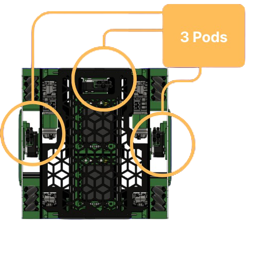
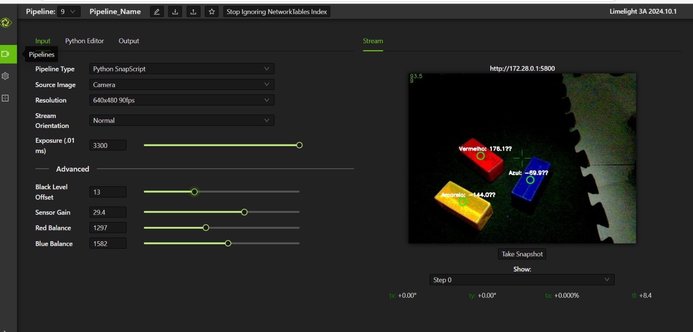

# SpaceTech-IntoTheDeep
Este repósitorio é a documentação publica do processo de engenharia, projetos e impacto durante a temporada Into The Deep da equipe SpaceTech 23504 no First Tech Challenge(FTC). Que culminou no premio primeiro lugar Inspire Award no campeonato Run for The Robotics em Kentucky, USA.

## Competições
<h3> Run For The Robots Premier Event - Kentucky/USA </h3>
<ul>
<li> Inspire Award</li>
</ul>
<h3> Brazil ChapionShip - Brasília </h3>
<ul>
    <li>Innovate Award sponsored by RTX 2nd Place</li>
</ul>
<h3>Torneio Regional SESI de Robótica - Pernambuco</h3>
<ul>
    <li> Winning Alliance - Captain </li>
    <li>Design Award</li>
</ul>
<br>

# Visão Geral
Em breve...

# Mecânica
Em breve...

# Software
### Sensores Utilizados
2x [Swingarm Odometry Pod](https://www.gobilda.com/swingarm-odometry-pod-48mm-wheel/) <br>
1x [Pinpoint V2 Odometry Computer](https://www.gobilda.com/pinpoint-v2-odometry-computer-imu-sensor-fusion-for-2-wheel-odometry/) <br>
2x [Touch Sensor](https://www.revrobotics.com/rev-31-1425/) <br>
1x [LimeLight3A-CameraVision](https://stemos.com.br/produto/22036390/) <br>

## Odometria

Utilizamos os 2 Pods de odometria para estimar a posição em tempo real do robô em relação a arena, juntamente com o Pinpont Odometry Computer que tem um IMU integrado; assim foi possível gerar uma posição cartesiana com coordenadas X e Y e a orientação em graus do robô.



Com isso em mão era possivel criar trajetórias e aplicar algoritimos de controle durante o curso do robô no periodo autonomo garantindo que o percurso realizado fosse sempre o mesmo indenpendentes das váriações de ambiente externo ou interno. 

Com a biblioteca [Pedro Patching](https://pedropathing.com/) os caminhos são gerados a partir de curvas de bezier e são aplicados 3 algoritimos de PID (lateral, frontal e de posição), com adição de uma correção a força centripeda. Os caminhos podem ser criados apartir do [Pedro Patching Visualizer](https://visualizer.pedropathing.com/).

<video controls muted width="500" >
<source src="assets/videos/PedroPathing-Visualizer1.mp4" type="video/mp4">
</video>

Observe os primeiros testes da correção de caminhos com um primeiro protótipo:

<video controls muted autoplay width="500" preload="metadata">
<source src="assets/videos/pathing-correction.mp4" type="video/mp4">
</video>


## Controle PID + FeedFoward
Para o controle de posição dos mecânismos como os elevedores e estensores utilizamos o controle Proporcional, Integratico e Derivativo e proporciona uma correção que simultaniamente contabiliza o tamanho do erro e aplica uma correção dinâmica, leva em consideração a taxa de variação dimunuindo o tempo de resposta e a somatória dos erros durante o periodo diminuindo o ruído criado com o tempo. 

$$u(t) = K_p e(t) + K_i \int_{0}^{t} e(\tau) d\tau + K_d \frac{de(t)}{dt}$$

Onde: <br>
- $e(t)$: É o erro, calculado como $SP - PV$ (Ponto de referencia - entrada do sensor).<br>
- $K_p$: Ganho Proporcional (corrige o erro atual).<br>
- $K_i$: Ganho Integral (corrige o erro acumulado no passado).<br>
- $K_d$: Ganho Derivativo (prevê o erro futuro com base na taxa de variação)<br>
<br>

Os motores utilizados possuem encoders imbutidos que retornam a posição em ticks por revolução facilmente com um cálculo que leve em consideração a relação de reduções utilizada convertemos esse valor em uma posição relativa da rotação do motor dado em angulos.

```java
double CPR = [Ticks por revolução aqui];

// Pega posição atual do motor
int position = motor.getCurrentPosition();
double revolutions = position/CPR;

double angle = revolutions * 360;
```

Porém apenas isso não foi suficiente porque como nessa temporada tinhamos um elevador vertical ele estava constantemente sendo influenciado pela gravidade o que com um controle PID sozinho se tornava díficil de contornar. Por isso implmentamos a adição do controle FeedFoward, ele pode ser chamado de controle antecipatório porque funciona em malha aberta sem depender de dados externos oferecendo a maior parte da quantidade da energia necessária para a conclusão de um movimento e seu ganho é configurado previamente.

Ambos foram implementados utilizando a biblioteca [NextFTC-0.6](https://v0.nextftc.dev/user-guide/subsystems/lift)

### Resultado:

<video controls muted autoplay width="250" preload="metadata">
<source src="assets/videos/pid.mp4" type="video/mp4">
</video>

## Computação Visual

Utilizamos a Limeligth 3A que é uma camera com integração IA para automatizar alguns processos durante o jogo querimos indentificar as amostras de jogo e a sua orientação para saber qual era a posição correta da garra que teriamos que utilizar para economizar tempo e aumentar a confiabilidade.

Utilizamos a biblioteca OpenCv e com o ColorBlob Detector, basicamente indentificamos zonas que tem uma grande quantidade de pixels com um cor expecifica como o vermelho, o azul ou amarelo e criamos um contorno retangular nesta área. Se o a largura do retângulo for maior do que a altura a amostra está na horizontal se não na vertical e assim criamos um gatilho para a garra descer na posição predefinida de coleta

<br>

<video controls muted autoplay width="250" preload="metadata">
<source src="assets/videos/coleta.mp4" type="video/mp4">
</video>

<br>




